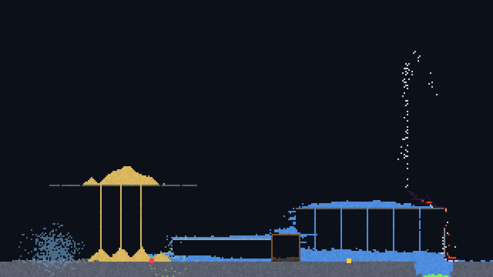
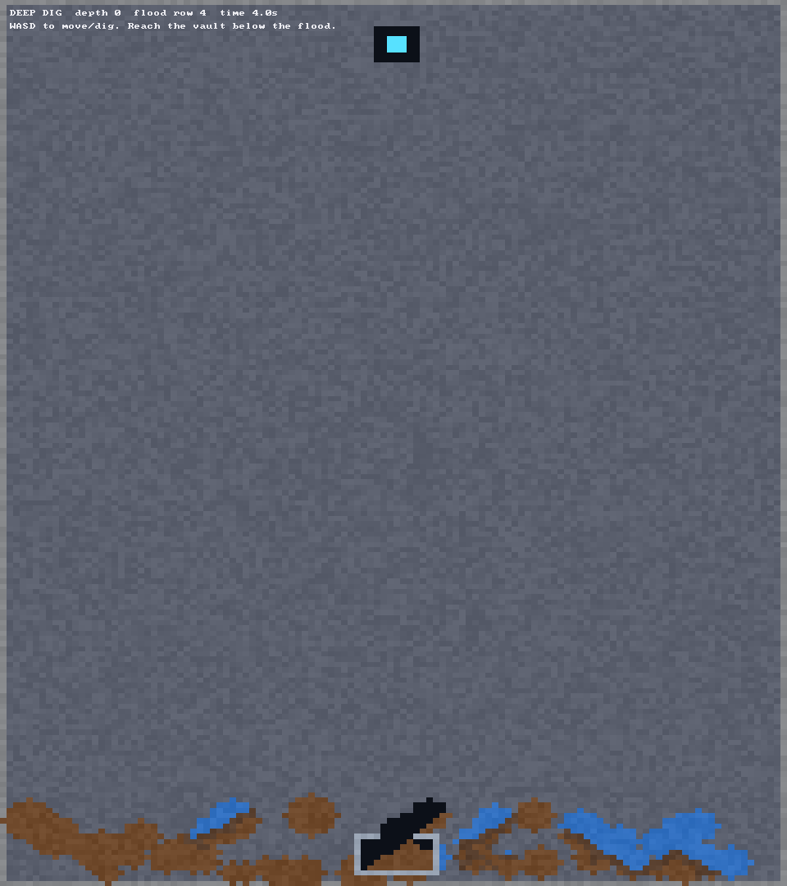

# Meat2D Engine

Meat2D is a C++20 2D game engine for side-scrollers, top-down games,
metroidvanias, shooters, sandboxes, and destructible-terrain games. Its
deterministic cellular simulation is an optional gameplay system and a strong
foundation for falling-sand and terrain-destruction projects, not a restriction
on the kinds of games the engine can create.

The project is intentionally early. Its first working slice combines a
deterministic world runtime, authoritative multiplayer, a graphical project
editor, selectable game-type starters, and one-command packaging.

| Interactive sandbox (elements lab) | `examples/deep_dig` |
| --- | --- |
|  |  |

## Current capabilities

- Deterministic fixed-step cellular simulation with no floating-point values in
  authoritative cells
- 64×64 chunks with active/sleeping states, dirty bounds, and revisions
- Eight-byte cells suitable for large worlds and network deltas
- Stable serialized material IDs
- 25 stable materials spanning granular, liquid, gas, solid, and energy phases
- Fixed-point heat transfer, freezing, melting, boiling, and condensation
- Fire, smoke, steam, oil, wood, acid corrosion, lava cooling, electricity,
  plant growth, and deterministic explosions
- Tick-ordered entity command buffer shared by autonomous and external control
- Utility-driven grazers, predators, and workers with needs, danger response,
  resource use, combat, hauling, construction, and reproduction
- Bounded deterministic crowd steering with stable agent IDs, target seeking,
  local separation, and world bounds
- Fixed-point neural-network inference and budgeted machine-learning agents
- Bounded headless learning environments with validated observations, actions,
  rewards, terminal transitions, and episode limits
  with deterministic action selection and reward state; training remains an
  external pipeline
- Eight-byte cellular organisms with encoded traits, metabolism, environmental
  fitness, motility, digestion, reproduction, and mutation
- Seeded traversal that avoids a permanent left/right bias
- Interactive SDL3 elements laboratory with the complete paintable catalog
- Dirty-region rasterization and partial texture uploads driven by per-chunk
  dirty bounds, in both local and replicated views
- Headless simulation/server target
- State hashing, unit tests, cross-chunk tests, and a benchmark
- Nonblocking UDP client/server sessions for two to eight players on Windows
  and Linux
- Session-token handshake, tick-windowed inputs, sequence/ack bitfields,
  retransmission, duplicate suppression, and keepalives
- Per-client chunk interest, RLE cell deltas, MTU-safe fragmentation,
  snapshots, and a replicated client world
- Predicted local painting reconciled through snapshot input acknowledgements
  and hash-verified authoritative chunks
- Same-machine/direct joins, automatic LAN discovery, public server listings,
  and directory-assisted UDP hole punching
- Self-hostable `meat2d_directory` service; gameplay remains peer-to-server
- Installable `Meat2D::Core`, `Meat2D::Net`, and `Meat2D::Tools` CMake
  targets and CPack SDK archives
- General scene runtime with stable entity IDs, transform/sprite/collider
  components, deterministic hashing, and versioned scene serialization
- Backend-neutral keyboard/mouse input state, action bindings, integer camera
  transforms, scene collider queries, fixed-tick sprite animation, and
  deterministic kinematic movement
- Initial rigid-body component/stepper with gravity, acceleration, velocity
  limits, collision response, category/mask filtering, and deterministic
  particle simulation
- Renderer-neutral bounded debug draw commands for lines, rectangles, circles,
  and text
- Graphical project editor with guarded code/config editing, native asset
  import, external-change detection, PNG/JPEG preview, sprite-sheet grids, and
  animation metadata
- Side-scroller/action-platformer, top-down/RTS, RPG, visual-novel,
  destructible-artillery, cellular-roguelite, falling-sand, and sandbox-survival
  starters plus
  background build, test, package, and GitHub publishing actions
- Editor-hosted test sessions with one-click local hosting and direct, LAN, or
  public-directory joins
- Transport-neutral MCP editor/tooling gateway for authenticated scene
  discovery, inspection, and consent-gated edits; protocol transport remains
  optional and outside authoritative gameplay

## Build

Requirements:

- C++20 compiler
- CMake 3.24+
- Ninja, Make, or a supported IDE generator
- Git, used by CMake to fetch pinned SDL 3.4.10 for the interactive client

```bash
cmake --preset dev
cmake --build --preset dev
ctest --preset dev
```

For a dependency-light headless build:

```bash
cmake --preset headless
cmake --build --preset headless
ctest --preset headless
```

Run:

```bash
./build/dev/meat2d_sandbox
./build/dev/meat2d_launcher
./build/headless/meat2d_server --ticks 600
./build/headless/meat2d_benchmark
```

On a multi-config generator, executables may be under a `Debug` or `Release`
subdirectory.

## Multiplayer quick start

Start the real-time authoritative server:

```bash
./build/headless/meat2d_server --listen --port 27182
```

Connect one or more graphical living labs:

```bash
./build/dev/meat2d_sandbox --connect localhost --port 27182 --name Player1
```

Or use the headless connection/replication smoke client:

```bash
./build/headless/meat2d_remote --host localhost --port 27182
```

List LAN sessions:

```bash
./build/headless/meat2d_remote --list-lan
```

For public listings, deploy `meat2d_directory`, point the dedicated server at
it with `--public-directory`, then browse with `--list-public`. The directory
introduces peers but never relays gameplay. See
[Discovery and player-hosted sessions](docs/DISCOVERY_AND_HOSTING.md) for
commands, port/firewall setup, and NAT limitations.

The graphical sandbox can join a selected public listing by ID:

```bash
./build/dev/meat2d_sandbox --server-id 123456789 \
  --directory directory.example.com --directory-port 27184 --name Player1
```

The editor's **Multiplayer** tab can start and stop the bundled dedicated
server, join the local host, join a hostname/IP directly, and launch a client
from either its LAN or public server list. Set the directory endpoint there
before enabling public advertisement. Editor-launched test processes close
with the editor.

Give the dedicated server a persistence directory to survive restarts — it
loads any saved chunks on startup and saves the whole world on a clean stop
(`Ctrl+C`/`SIGTERM`, or hitting `--ticks`):

```bash
./build/headless/meat2d_server --listen --port 27182 --persist ./world-save
```

See [Persistence and streaming](#persistence-and-streaming) below for how the
on-disk format works and what it does not yet cover.

In connected graphical clients, left/right painting is sent as validated,
tick-targeted input to the server and simultaneously predicted on the local
replica for immediate feedback. The displayed material world remains the
interest-managed replica: authoritative chunk deltas overwrite predictions,
unacknowledged paints are re-applied until the server confirms them, and every
applied chunk is verified against the server's chunk hash.

## Elements-lab controls

| Input | Action |
| --- | --- |
| Left mouse | Paint the selected material |
| Right mouse | Erase |
| Middle mouse | Seed the selected cellular organism |
| Mouse wheel | Change brush radius |
| `0` | Select empty/eraser |
| `1` | Select sand |
| `2` | Select water |
| `3` | Select stone |
| `4` | Select wood |
| `5` | Select oil |
| `6` | Select fire |
| `7` | Select acid |
| `8` | Select lava |
| `9` | Select gunpowder |
| `Q` / `E` | Select previous/next material in the full catalog |
| `Z` | Select photosynthetic organisms |
| `X` | Select decomposer organisms |
| `V` | Select extremophile organisms |
| `Space` | Pause |
| `F1` | Toggle the profiling overlay (frame/step timing, chunk and cell stats) |
| `N` | Advance one tick |
| `R` | Reset the laboratory |
| `C` | Clear the world |
| `Esc` | Quit |

`meat2d_sandbox`/`meat2d_example_deep_dig --frames N --screenshot out.png` runs
headlessly (a real, on-screen-capable video driver, not `SDL_VIDEODRIVER=dummy`
— that renders nothing) for `N` frames, captures the final frame with
`SDL_RenderReadPixels`, and exits. That's how the screenshots above were made,
and it's reusable for regression screenshots in CI.

## Use the core from another CMake project

During engine development, `FetchContent` is the shortest integration path:

```cmake
include(FetchContent)

set(MEAT2D_BUILD_CLIENT OFF CACHE BOOL "" FORCE)
set(MEAT2D_BUILD_LAUNCHER OFF CACHE BOOL "" FORCE)
set(MEAT2D_BUILD_SERVER OFF CACHE BOOL "" FORCE)
set(MEAT2D_BUILD_REMOTE_CLIENT OFF CACHE BOOL "" FORCE)
set(MEAT2D_BUILD_DIRECTORY OFF CACHE BOOL "" FORCE)
set(MEAT2D_BUILD_CLI OFF CACHE BOOL "" FORCE)
set(MEAT2D_BUILD_TESTS OFF CACHE BOOL "" FORCE)
set(MEAT2D_BUILD_BENCHMARKS OFF CACHE BOOL "" FORCE)
set(MEAT2D_BUILD_EXAMPLES OFF CACHE BOOL "" FORCE)

FetchContent_Declare(
    Meat2D
    GIT_REPOSITORY https://github.com/MidwestMysteryMeat/Meat2DEngine.git
    GIT_TAG main
)
FetchContent_MakeAvailable(Meat2D)

target_link_libraries(your_game PRIVATE Meat2D::Core) # simulation only
# target_link_libraries(your_game PRIVATE Meat2D::Render) # WorldView dirty-region rasterization
# target_link_libraries(your_game PRIVATE Meat2D::Net) # simulation + networking
```

Tagged releases will replace `main` as the recommended `GIT_TAG`.

The core can also be installed and consumed with `find_package`:

```bash
cmake --install build/release --prefix meat2d-sdk
```

```cmake
find_package(Meat2D CONFIG REQUIRED)
target_link_libraries(your_game PRIVATE Meat2D::Net)
```

## Determinism contract

The authoritative simulation uses integer coordinates, fixed-point
temperature, a fixed tick, stable material IDs, and coordinate/tick-derived
noise. Two worlds with equal configuration, state, and commands must produce
the same state hash after every tick.

Determinism is required for reproducible debugging and compact network
validation. Multiplayer is server-authoritative; clients are not trusted merely
because deterministic replay is available.

## Parallel simulation

`World::step_parallel(workers = 0)` multithreads a tick across chunk phases
(`0` picks `hardware_concurrency`) instead of `step()`'s single-threaded
scanline — a different, dependency-safe update order (see
[Parallel chunk scheduling](docs/ARCHITECTURE.md#parallel-chunk-scheduling)
for why that's necessary and how it stays race-free), not a drop-in
replacement: its exact per-tick outcome doesn't have to match `step()`'s, but
it is required to be — and is tested to be — identical run-to-run regardless
of worker count.

```bash
./build/headless/meat2d_server --ticks 600 --parallel        # auto worker count
./build/headless/meat2d_server --ticks 600 --parallel 4      # explicit
```

## Persistence and streaming

`meat2d::ChunkStore` (`include/meat2d/sim/ChunkStore.hpp`) saves and loads a
`World`'s chunks one file per chunk under a directory, so cold regions of a
large world don't have to stay resident in memory between sessions, and a
server or editor can save/restore state without serializing the whole grid
at once. `meat2d_server --persist <dir>` is the built-in consumer: it loads
any existing save on startup and writes the whole world back out on a clean
stop.

This persists chunks within a world's existing size — it does not extend a
world beyond the bounds it was created with, and it does not cover
`ai::LivingSimulation` agents or `life::OrganismField` (they carry per-entity
state a chunk file doesn't capture, so agents respawn fresh on reload). An
unbounded/streamed world, where chunks page in beyond the initial grid,
needs `World`'s fixed chunk-grid addressing to become dynamic — a larger
change ChunkStore's on-disk format is meant to be the paging primitive for,
not something it does today.

## Determinism replay

`meat2d::replay` records a `World` session (paint events plus periodic
state-hash checkpoints) to a portable `.replay` file and can deterministically
re-simulate it, comparing every checkpoint and stopping at the first
mismatch. `meat2d_replay <file.replay>` is the command-line front end — a
MATCHED/DIVERGED verdict with the exact divergent tick, useful for catching a
determinism regression instead of only noticing "the final state differs".
Like ChunkStore, this covers `World` only, not agents or organisms.

## Project layout

```text
apps/
  cli/           project creation/build/package/publish command
  launcher/      graphical editor, code/asset browser, sessions, sprite manager
  sandbox/       SDL3 interactive living laboratory
  server/        headless benchmark and authoritative server
  remote/        headless multiplayer smoke client
  directory/     self-hostable public listing and NAT introduction service
  replay/        offline .replay file verification (meat2d_replay)
benchmarks/      simulation throughput checks
cmake/           installed-package configuration
docs/            architecture and roadmap
examples/        deep_dig, a complete example game built on the public API
include/meat2d/  public engine API
src/             engine implementation, including scene, input, and camera
                 runtime systems
templates/       selectable side-scroller, top-down, metroidvania, and
                 falling-sand game starters
tests/           unit and determinism tests
```

Tagged releases (`vX.Y.Z`) publish prebuilt Windows and Linux SDK archives
(headers, libraries, and CMake package config) as GitHub release assets.

See [Networking](docs/NETWORKING.md), [AI and Life](docs/AI_AND_LIFE.md),
[Materials](docs/MATERIALS.md), [Architecture](docs/ARCHITECTURE.md),
[Roadmap](docs/ROADMAP.md), and the
[implementation plan](docs/IMPLEMENTATION_PLAN.md) for the roadmap's open
items. See [Template taxonomy](docs/TEMPLATE_TAXONOMY.md) for the genre
starter boundaries and production gate. See [Project editor](docs/EDITOR.md) for the
code/asset browser, sprite workflow, hosted test sessions, and one-click
build/package tools.

## License

Licensed under the **[Apache License 2.0](LICENSE)** — free to use, modify, fork and build on, commercially or not.

**Credit is required.** Apache-2.0 §4(c)–(d) obliges you to keep the copyright notice and to reproduce [`NOTICE`](NOTICE) in anything you distribute, including binaries and hosted builds. Credit it as `Meat2DEngine by MysteryMeat` (https://github.com/MidwestMysteryMeat/Meat2DEngine) in your credits screen, About box, or docs. The project name and the MysteryMeat name are not licensed for endorsement or promotion (§6).

SDL is fetched as a separate dependency under its own zlib license.

Previously MIT; relicensed to Apache-2.0 on 2026-07-30. Snapshots released under MIT stay MIT.
